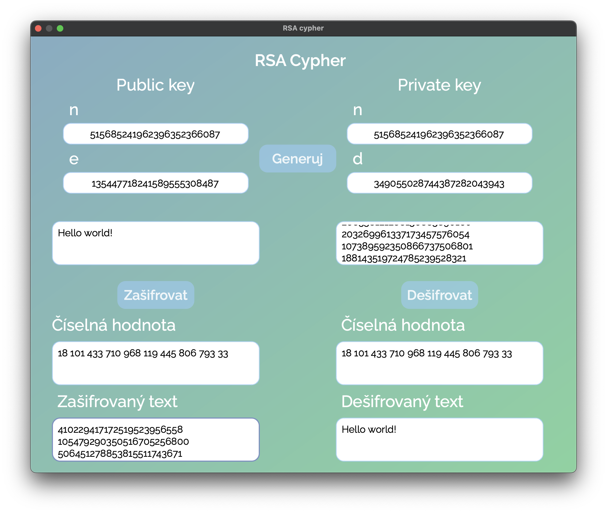

# RSACypher

RSACypher is a Python application that implements the RSA encryption and decryption algorithm. It includes a graphical user interface (GUI) built with PyQt6.

## 🎮 Features

- Encrypts and decrypts text using the RSA algorithm.
- Generates public and private keys.
- Provides a user-friendly GUI for easy interaction.

## 🧠 GUI Overview

- **Zadejte text k šifrování**: Enter the text to be encrypted.
- **Public key (n, e)**: Enter the public key for encryption.
- **Zašifrovat**: Button to encrypt the text.
- **Zašifrovaný text**: Displays the encrypted text.
- **Zadejte text k dešifrování**: Enter the text to be decrypted.
- **Private key (n, d)**: Enter the private key for decryption.
- **Dešifrovat**: Button to decrypt the text.
- **Dešifrovaný text**: Displays the decrypted text.
- **Generuj**: Button to generate public and private keys.

## 📊 Example

### Encryption

1. Enter the text to be encrypted in the **Zadejte text k šifrování** field.
2. Enter the public key (n, e) in the respective fields.
3. Click the **Zašifrovat** button.
4. The encrypted text will be displayed in the **Zašifrovaný text** field.

### Decryption

1. Enter the text to be decrypted in the **Zadejte text k dešifrování** field.
2. Enter the private key (n, d) in the respective fields.
3. Click the **Dešifrovat** button.
4. The decrypted text will be displayed in the **Dešifrovaný text** field.

---

#### Author: Filip Hajduch
###### and GitHub Copilot